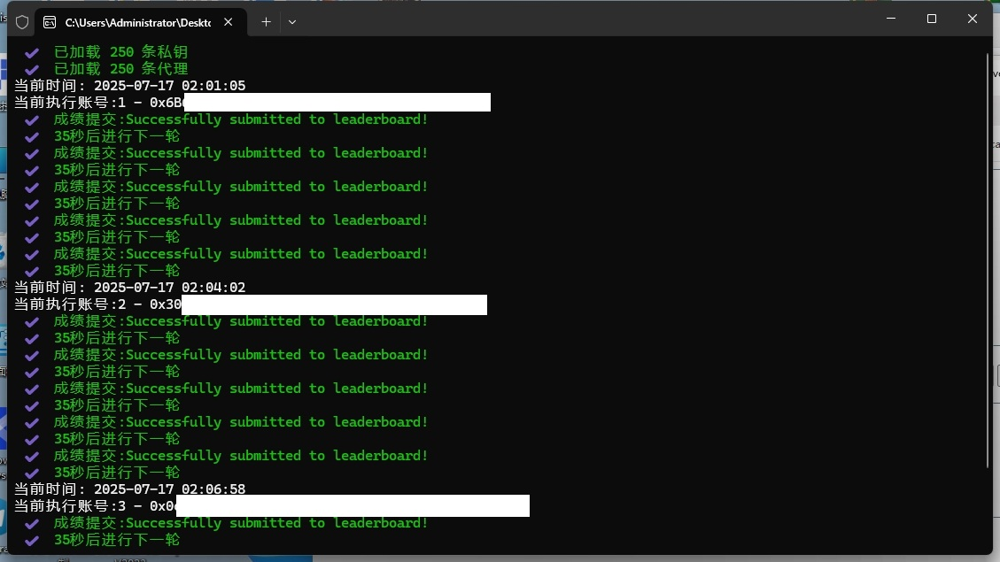

# Irys_Spritetype 打字小游戏脚本

## 🚀简介  
---
### 这是一个 **护肝型脚本**，用于自动完成 Irys 平台上的打字小游戏任务。
---
## 📝功能说明  
- 每组账号执行 **5 次**打字小游戏  
- 每次打字之间间隔 **35 秒**（基于游戏风控频率）
- 每天循环运行
- 任务完成后可在银河打卡  
- 自动计算 **准确率、WPM、字符数** 等信息  
- **无需私钥**
---

## 📦 文件结构

* `Address.txt`：每行一以太坊地址
* `Proxy.txt`：每行一个代理，支持以下格式（不支持SOCKS)：

```txt
ip:port
http://ip:port
https://ip:port
http://username:password@ip:port
https://username:password@ip:port
```

* `Log.txt`：运行日志自动写入本文件

## 🖥️ 系统支持

* Windows、Linux、macOS


## 🌌 运行截图  
下图为脚本运行时的终端界面示意：



---

---

## 🤝 贡献指南

欢迎提交 Issues 或 Pull Requests

---


